# ERD — Entity Relationship Diagram

```mermaid
erDiagram
    User ||--o{ GoldPriceAlert : creates
    User ||--o{ GoldPortfolio : owns
    User ||--o{ Session : has
    GoldPortfolio ||--o{ GoldPortfolioItem : contains
    GoldType ||--o{ GoldPrice : has
    GoldType ||--o{ GoldPriceHistory : tracks
    GoldType ||--o{ GoldPriceAlert : triggers
    GoldType ||--o{ GoldPortfolioItem : references

    Bank ||--o{ ExchangeRate : publishes
    Bank ||--o{ ExchangeRateHistory : archives
    Bank ||--o{ BankInterestRate : offers
    Bank ||--o{ BankInterestRateHistory : archives

    StockIndex ||--o{ StockIndexHistory : tracks
    Stock ||--o{ StockQuote : has

    SeoPage ||--o{ SeoFaq : contains
    NewsArticle ||--o{ SeoFaq : contains

    User {
        string id PK
        string email UK
        enum role
        datetime createdAt
    }

    GoldType {
        string id PK
        string code UK
        string nameVi
        enum brand
        enum purity
        string currency
    }

    GoldPrice {
        string id PK
        string goldTypeId FK
        decimal buyPrice
        decimal sellPrice
        datetime recordedAt
    }

    GoldPriceHistory {
        string id PK
        string goldTypeId FK
        decimal buyPrice
        decimal sellPrice
        decimal openBuy
        decimal highBuy
        decimal lowBuy
        string interval
        datetime recordedAt
    }

    GoldPriceAlert {
        string id PK
        string userId FK
        string goldTypeId FK
        enum condition
        decimal targetPrice
        boolean isActive
    }

    GoldPortfolio {
        string id PK
        string userId FK
        string name
    }

    Bank {
        string id PK
        enum code UK
        string nameVi
    }

    ExchangeRate {
        string id PK
        string bankId FK
        enum currency
        decimal buyRate
        decimal sellRate
        datetime recordedAt
    }

    BankInterestRate {
        string id PK
        string bankId FK
        enum term
        decimal rate
        datetime recordedAt
    }

    StockIndex {
        string id PK
        string code UK
        enum market
        decimal value
        decimal changePct
    }

    Stock {
        string id PK
        string symbol UK
        enum market
    }

    FuelPrice {
        string id PK
        enum fuelType
        decimal price
        datetime recordedAt
    }

    NewsArticle {
        string id PK
        string slug UK
        enum category
        enum status
        boolean isAiGenerated
    }

    SeoPage {
        string id PK
        string slug UK
        enum pageType
        string title
        json structuredData
    }

    AdCampaign {
        string id PK
        enum adType
        enum position
        boolean isActive
        int impressions
        decimal revenue
    }

    CronJobLog {
        string id PK
        string jobName
        enum status
        int durationMs
        int recordsSync
    }
```

## Key Relationships

- **Gold**: `GoldType` is the dimension table; `GoldPrice` stores snapshots; `GoldPriceHistory` stores OHLC daily rollups for candlestick charts
- **Forex/Interest**: `Bank` is shared dimension across exchange rates and interest rates
- **SEO**: `SeoPage` + `SeoFaq` power programmatic landing pages with FAQ Schema
- **Ops**: `CronJobLog` + `ApiSyncLog` for observability
